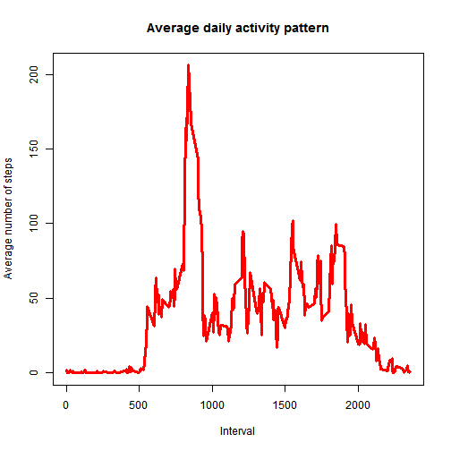
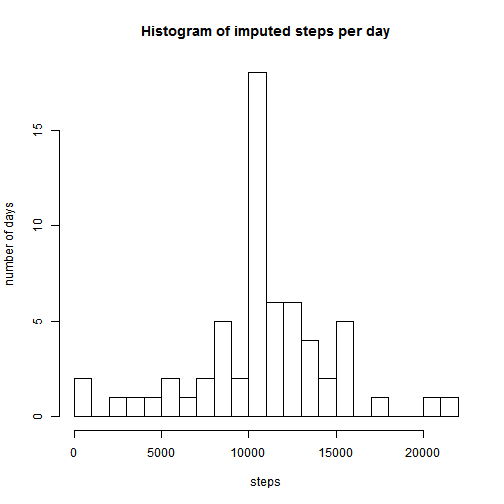
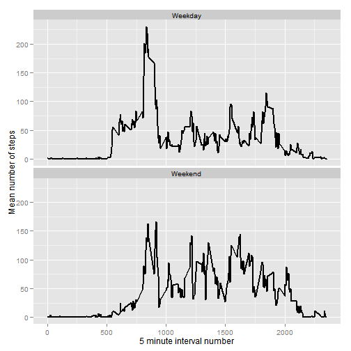

# Reproducible Research: Peer Assessment 1


## Loading and preprocessing the data

```r
fname <- unzip("activity.zip")
activity <- read.csv(fname, colClasses = c("integer", "Date", "integer"))
```

## What is mean total number of steps taken per day?

a. Make a histogram of the total number of steps taken each day


```r
library(plyr)
stepsPerDay <- ddply(activity,.(date), summarize, steps = sum(steps, na.rm=T))
barplot(stepsPerDay$steps, names.arg=stepsPerDay$date, xlab="date", ylab="steps")
```

 

b. Calculate and report the **mean** and **median** total number of
   steps taken per day


```r
meanVal <- mean(stepsPerDay$steps)
medianVal <- median(stepsPerDay$steps)
```
Mean value equal 9354.2295 and median equal 10395.

## What is the average daily activity pattern?

a. Make a time series plot (i.e. type = "l") of the 5-minute interval (x-axis) and the average number of steps taken, averaged across all days (y-axis)


```r
avgsteps<-ddply(activity, ~interval, summarize, avg=mean(steps, na.rm=TRUE))
plot(x<-avgsteps$interval, y<-avgsteps$avg, type = "l", lwd=3, col="red", main="Average daily activity pattern", xlab="Interval", ylab="Average number of steps")
```

 

b. Which 5-minute interval, on average across all the days in the dataset, contains the maximum number of steps?


```r
intervalMax <- avgsteps$interval[which.max(avgsteps$avg)]
```

Interval 835 contains the maximum number of steps.

## Imputing missing values

a. Calculate and report the total number of missing values in the dataset (i.e. the total number of rows with `NA`s)


```r
missingRow <- sum(is.na(activity))
```

The total number of missing values in the dataset is 2304.

b. Devise a strategy for filling in all of the missing values in the dataset. The strategy does not need to be sophisticated. For example, you could use the mean/median for that day, or the mean for that 5-minute interval, etc.

Missing values will be imputed based on the mean number of steps for a given interval in the day.

Generate the mean number of steps per interval (as above):


```r
stepsPerInterval <- ddply(activity,.(interval), summarize, steps = mean(steps, na.rm=T))
```

2. Using a loop, create a vector of imputed values. If an NA is found in steps, replace the value with the mean number of steps for that interval of the day.


```r
#create a list called stepsImpute, fill with NAs
stepsImpute <- vector("list",nrow(activity))

#Loop through rows of activity to impute values
for (row in seq(1:nrow(activity))) {
  #if current row has NA, then impute using the average steps for that interval
  if (is.na(activity[row,]$steps)) {
    stepsImpute[[row]] <- stepsPerInterval$steps[[which(stepsPerInterval$interval==activity[row,]$interval)]]
  } else {
    stepsImpute[[row]] <- activity[row,]$steps
  }
}
```

### Add the imputed data back into the original dataset

```r
activity$stepsImputed <- unlist(stepsImpute)
```

### Histogram, mean and median of the imputed data
Create a new dataframe with total steps per day using the imputed values:


```r
stepsPerDayImputed <- ddply(activity,.(date), summarize, steps = sum(stepsImputed, na.rm=T))
```

#### Histogram

```r
hist(stepsPerDay$steps, breaks=20, main="Histogram of steps per day",
     xlab = "steps", ylab = "number of days")
```

 

```r
hist(stepsPerDayImputed$steps, breaks=20, main="Histogram of imputed steps per day", xlab = "steps", ylab = "number of days")
```

 

#### Mean number of imputed steps per day:


```r
mean(stepsPerDayImputed$steps, na.rm=T)
```

```
## [1] 10766
```

#### Median imputed steps per day:

```r
quantile(stepsPerDayImputed$steps, 0.5, na.rm=T)
```

```
##   50% 
## 10766
```

#### Comparing to the non-imputed data
As can be seen below, imputing missing steps by the mean number of steps per interval increases both the mean and median.


```r
comparison <- data.frame(mean=c(mean(stepsPerDay$steps, na.rm=T),mean(stepsPerDayImputed$steps, na.rm=T)),median=c(quantile(stepsPerDay$steps, 0.5, na.rm=T),quantile(stepsPerDayImputed$steps, 0.5, na.rm=T)),row.names=c("original","imputed"))

comparison
```

```
##           mean median
## original  9354  10395
## imputed  10766  10766
```

## Are there differences in activity patterns between weekdays and weekends?

* First, code which day of the week the date is in a variable called 'day'
* Second, code whether it is the weekend or weekday in a variable called 'weekday'
* Note: 'date' is converted from factor to POSIX using the lubridate package


```r
library(lubridate)
```

```
## Warning: package 'lubridate' was built under R version 3.1.1
```

```
## 
## Attaching package: 'lubridate'
## 
## The following object is masked from 'package:plyr':
## 
##     here
```

```r
Sys.setenv(LANG = "en")
activity$day <- weekdays(ymd(activity$date))
activity$weekday <- as.factor(ifelse(activity$day %in% c("Saturday","Sunday"),"Weekend","Weekday"))
```

Now, create a new dataset coding the average steps per interval for weekends and weekdays

```r
stepsPerIntervalSplit <- ddply(activity, .(weekday,interval), summarize, steps = mean(stepsImputed))
```

#### Time series plot weekends vs. weekdays
Uses the ggplot2 package:

```r
library(ggplot2)
```

```
## Warning: package 'ggplot2' was built under R version 3.1.1
```

```r
timeseriesplot <- ggplot(stepsPerIntervalSplit,aes(interval,steps)) + geom_line(size=1) + facet_wrap(~weekday,ncol=1) + ylab("Mean number of steps") + xlab("5 minute interval number")

timeseriesplot
```

 
